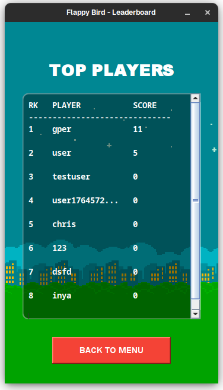

# Laporan Proyek Akhir


Anggota Kelompok 4:
1. **Christian Hadi Candra** (F1D02310108)
2. **Rafly Ridho' Sukardi** (F1D0231000)
3. **Umam Alparizi** (F1D02310141)

Asisten: **Michael Effendy**

---

## 📋 Overview Program

Flappy Bird adalah implementasi game klasik yang dikembangkan menggunakan Java dengan pendekatan pemrograman berorientasi objek. Game ini menantang pemain untuk mengendalikan seekor burung yang harus terbang melewati serangkaian pipa tanpa menabrak obstacle maupun menyentuh tanah. Pemain mengontrol burung dengan menekan tombol spasi untuk membuat burung melompat melawan gravitasi.

Program ini dilengkapi dengan sistem manajemen pengguna yang komprehensif, dimana setiap pemain dapat membuat akun, login, dan menyimpan progress permainan mereka. Sistem database terintegrasi memungkinkan penyimpanan high score dan preferensi customization seperti warna burung dan tema background. Fitur leaderboard memberikan aspek kompetitif dengan menampilkan ranking pemain berdasarkan skor tertinggi yang pernah dicapai.

Dari segi teknis, aplikasi ini mengimplementasikan physics engine sederhana untuk simulasi gravitasi dan momentum, sistem collision detection untuk mendeteksi tabrakan, serta audio system yang mendukung sound effects dan background music. Interface pengguna dirancang dengan multiple screen navigation yang smooth, mulai dari login screen, main menu dengan customization options, hingga gameplay screen yang responsive.

Game ini juga menampilkan fitur visual yang menarik seperti animasi sprite burung dengan wing-flapping animation, parallax scrolling background, dan rotasi burung yang realistis berdasarkan kecepatan gerakan. Sistem scoring real-time memberikan feedback immediate kepada pemain, sementara game over screen menyediakan opsi untuk restart atau kembali ke menu utama.

---

## 🎯 Tujuan Praktikum

Pada modul ini, tujuan utama adalah memahami dan mengimplementasikan konsep pemrograman berorientasi objek dalam pengembangan aplikasi game sederhana. Proyek Flappy Bird ini dirancang untuk menerapkan berbagai konsep fundamental yang telah dipelajari sepanjang praktikum, meliputi konsep inheritance dan polymorphism untuk menciptakan hierarki kelas yang efisien, implementasi interface dan abstract class untuk mendefinisikan kontrak antar komponen, pengembangan graphical user interface menggunakan Java Swing untuk menciptakan pengalaman pengguna yang interaktif, serta integrasi thread programming dan database connectivity untuk menangani operasi concurrent dan persistensi data.

Melalui pengembangan game Flappy Bird ini, diharapkan dapat memahami bagaimana konsep-konsep teoritis OOP diterapkan dalam skenario pengembangan aplikasi nyata, mulai dari desain arsitektur sistem hingga implementasi fitur-fitur kompleks seperti sistem autentikasi pengguna, manajemen skor, dan pengaturan preferensi pengguna.

---

## 📖 Konsep dan Pelajaran Utama yang Diimplementasikan

### 1. Encapsulation (Enkapsulasi)

Konsep enkapsulasi diterapkan secara konsisten di seluruh proyek untuk menjaga integritas data dan mengontrol akses terhadap atribut-atribut kelas. Implementasi enkapsulasi terlihat jelas pada kelas `User` yang mengelola data pengguna dengan semua atribut dideklarasikan sebagai private untuk mencegah akses langsung dari luar kelas.

```java
public class User {
    private int id;
    private String username;
    private String password;
    private int highScore;
    private String birdColor;
    private String backgroundMode;
    private static User currentUser = null;

    public User(String username, String password) {
        this.username = username;
        this.password = password;
        this.highScore = 0;
        this.birdColor = "yellow";
        this.backgroundMode = "day";
    }

    public int getId() { return id; }
    public String getUsername() { return username; }
    public int getHighScore() { return highScore; }
    public void setHighScore(int score) { this.highScore = score; }
    public void setBirdColor(String color) { this.birdColor = color; }
}
```

Kelas `Bird` juga menerapkan enkapsulasi dengan menyembunyikan detail implementasi physics simulation dan hanya menyediakan method public yang diperlukan untuk interaksi dengan objek burung.

```java
public class Bird {
    int x, y, width, height;
    Image img;
    int velocityY = 0;
    int gravity = 1;

    void update() {
        velocityY += gravity;
        y += velocityY;
        y = Math.max(y, 0);
    }

    void jump() {
        velocityY = -8;
    }

    Rectangle getBounds() {
        return new Rectangle(x, y, width, height);
    }
}
```

### 2. Inheritance (Pewarisan)

Konsep inheritance diimplementasikan melalui pewarisan dari kelas-kelas Java Swing untuk menciptakan komponen GUI yang kustomized. Kelas `FlappyBird` mewarisi dari `JPanel` untuk menciptakan area permainan yang dapat di-render secara custom, sementara kelas-kelas seperti `MainMenu`, `LoginFrame`, dan `LeaderboardFrame` mewarisi dari `JFrame` untuk menciptakan window aplikasi yang berbeda.

```java
public class FlappyBird extends JPanel implements ActionListener, KeyListener {
    int boardWidth = 360;
    int boardHeight = 640;

    public FlappyBird() {
        setPreferredSize(new Dimension(boardWidth, boardHeight));
        setFocusable(true);
        addKeyListener(this);
        loadAssets();
        initializeGame();
    }
}
```

Pewarisan ini memungkinkan kelas-kelas tersebut untuk memanfaatkan fungsionalitas dasar dari parent class sambil menambahkan behavior spesifik yang dibutuhkan untuk setiap komponen aplikasi.

### 3. Polymorphism (Polimorfisme)

Polimorfisme diterapkan melalui implementasi interface dan method overriding. Kelas `FlappyBird` mengimplementasikan multiple interface yaitu `ActionListener` dan `KeyListener`, yang memungkinkan objek yang sama untuk merespons berbagai jenis event dengan cara yang berbeda.

```java
public class FlappyBird extends JPanel implements ActionListener, KeyListener {
    @Override
    public void actionPerformed(ActionEvent e) {
        if (gameStarted && !gameOver) {
            // Update bird physics
            velocityY += gravity;
            birdY += velocityY;
            birdY = Math.max(birdY, 0);

            // Update pipes and check collisions
            updatePipes();
            checkCollisions();
        }
        repaint();
    }

    @Override
    public void keyPressed(KeyEvent e) {
        if (e.getKeyCode() == KeyEvent.VK_SPACE) {
            if (!gameStarted) {
                startGame();
            } else if (!gameOver) {
                jump();
            } else {
                resetGame();
            }
        }
    }
}
```

Polimorfisme juga terlihat pada penggunaan Timer dengan ActionListener yang berbeda untuk berbagai keperluan seperti game loop, animasi burung, dan spawning pipa.

### 4. Interface Implementation

Interface digunakan secara ekstensif untuk mendefinisikan kontrak behavior antar komponen. Implementasi `ActionListener` memungkinkan berbagai komponen untuk merespons event dengan cara yang konsisten, sementara `KeyListener` memberikan kemampuan untuk menangani input keyboard.

```java
// Timer untuk animasi sayap burung
animationTimer = new Timer(150, new ActionListener() {
    int frame = 0;
    @Override
    public void actionPerformed(ActionEvent e) {
        if (gameStarted && !gameOver) {
            frame++;
            currentBirdImg = birdImgs[frame % 3];
        }
    }
});
```

### 5. GUI Programming dengan Java Swing

Implementasi GUI menggunakan Java Swing mencakup multiple window management dan custom rendering. Setiap screen aplikasi diimplementasikan sebagai kelas terpisah yang mewarisi dari `JFrame`, memungkinkan navigasi yang smooth antar berbagai bagian aplikasi.

```java
public class MainMenu extends JFrame {
    private User currentUser;
    private BufferedImage dayBackground;
    private BufferedImage nightBackground;
    private int bgOffsetX = 0;
    private final AtomicBoolean running = new AtomicBoolean(true);
    private Thread parallaxThread;

    public MainMenu(User user) {
        this.currentUser = user;
        setTitle("Flappy Bird - Main Menu");
        initializeComponents();
        startParallaxAnimation();
    }
}
```

Custom rendering diimplementasikan pada kelas `Bird` dengan menggunakan `Graphics2D` untuk menciptakan efek rotasi yang realistis berdasarkan kecepatan gerakan burung.

```java
void draw(Graphics g) {
    Graphics2D g2d = (Graphics2D) g;
    AffineTransform old = g2d.getTransform();

    g2d.translate(x + width/2, y + height/2);
    double rotation = Math.toRadians(Math.max(-25, Math.min(90, velocityY * 4)));
    g2d.rotate(rotation);
    g2d.drawImage(img, -width/2, -height/2, width, height, null);

    g2d.setTransform(old);
}
```

### 6. Database Integration dengan JDBC

Integrasi database menggunakan JDBC memungkinkan persistensi data pengguna dan sistem leaderboard. Kelas `DatabaseConnection` mengelola koneksi ke database MySQL dan menyediakan method untuk operasi CRUD.

```java
public class DatabaseConnection {
    private static final String SERVER_URL = "jdbc:mysql://localhost:3306/";
    private static final String DATABASE_NAME = "db_flappy_bird";
    private static final String FULL_URL = SERVER_URL + DATABASE_NAME;

    static {
        try {
            Class.forName("com.mysql.cj.jdbc.Driver");
            initializeDatabase();
        } catch (ClassNotFoundException e) {
            System.err.println("MySQL driver not found: " + e.getMessage());
        }
    }
}
```

Operasi database diimplementasikan pada kelas `User` untuk menangani registrasi, login, dan update data pengguna.

```java
public boolean register() {
    try {
        Connection conn = DatabaseConnection.getConnection();
        String createTable = "CREATE TABLE IF NOT EXISTS users (" +
                "id INT AUTO_INCREMENT PRIMARY KEY, " +
                "username VARCHAR(50) UNIQUE NOT NULL, " +
                "password VARCHAR(255) NOT NULL, " +
                "high_score INT DEFAULT 0, " +
                "bird_color VARCHAR(10) DEFAULT 'yellow', " +
                "background_mode VARCHAR(10) DEFAULT 'day')";
        conn.createStatement().execute(createTable);

        String sql = "INSERT INTO users (username, password, high_score, bird_color, background_mode) VALUES (?, ?, 0, 'yellow', 'day')";
        PreparedStatement stmt = conn.prepareStatement(sql);
        stmt.setString(1, username);
        stmt.setString(2, password);
        return stmt.executeUpdate() > 0;
    } catch (SQLException e) {
        e.printStackTrace();
        return false;
    }
}
```

### 7. Thread Programming dan Concurrent Processing

Thread programming diimplementasikan untuk menangani multiple task secara concurrent, terutama untuk audio processing dan animasi background. Kelas `MusicPlayer` menggunakan static Clip untuk memastikan hanya satu instance musik yang berjalan pada satu waktu.

```java
public class MusicPlayer {
    private static Clip clip;

    public void play(String filepath, boolean loop) {
        if (clip != null && clip.isRunning()) {
            return;
        }

        try {
            stop();
            AudioInputStream audio = AudioSystem.getAudioInputStream(new File(filepath));
            clip = AudioSystem.getClip();
            clip.open(audio);
            if (loop) clip.loop(Clip.LOOP_CONTINUOUSLY);
            clip.start();
        } catch (Exception e) {
            System.out.println("Error playing music: " + e.getMessage());
        }
    }
}
```

Parallax scrolling background diimplementasikan menggunakan separate thread untuk menciptakan efek visual yang smooth tanpa mengganggu game loop utama.

---

## 💻 Implementasi Kode dan Hasil

Implementasi game engine menggunakan game loop pattern dengan Timer yang berjalan pada 60 FPS untuk memberikan pengalaman bermain yang smooth. Game loop utama menangani update physics, collision detection, dan rendering.

```java
public FlappyBird() {
    setPreferredSize(new Dimension(boardWidth, boardHeight));
    setFocusable(true);
    addKeyListener(this);

    loadAssets();
    pipes = new ArrayList<>();

    // Timer untuk spawn pipa (1.5 detik sekali)
    placePipeTimer = new Timer(1500, e -> placePipes());

    // Game Loop utama (60 FPS)
    gameLoop = new Timer(1000/60, this);
    gameLoop.start();
    animationTimer.start();
}
```

Sistem physics simulation mengimplementasikan gravitasi dan momentum untuk menciptakan gerakan burung yang realistis. Setiap frame, kecepatan vertikal burung bertambah karena gravitasi, dan posisi burung diupdate berdasarkan kecepatan tersebut.

Asset loading system memungkinkan customization visual berdasarkan preferensi pengguna yang tersimpan di database. Sistem ini secara dinamis memuat sprite burung dan background sesuai dengan pilihan pengguna.

```java
private void loadAssets() {
    try {
        String bgMode = currentUser != null ? currentUser.getBackgroundMode() : "day";
        String birdColor = currentUser != null ? currentUser.getBirdColor() : "yellow";

        backgroundImg = new ImageIcon("assets/sprites/background-" + bgMode + ".png").getImage();

        birdImgs[0] = new ImageIcon("assets/sprites/" + birdColor + "bird-upflap.png").getImage();
        birdImgs[1] = new ImageIcon("assets/sprites/" + birdColor + "bird-midflap.png").getImage();
        birdImgs[2] = new ImageIcon("assets/sprites/" + birdColor + "bird-downflap.png").getImage();
    } catch (Exception e) {
        System.err.println("Error loading images: " + e.getMessage());
    }
}
```

Collision detection menggunakan Rectangle bounds untuk mendeteksi tabrakan antara burung dengan pipa atau ground. Sistem ini memberikan feedback immediate ketika collision terjadi dan mengupdate high score jika diperlukan.

**Hasil Screenshot:**

### Tampilan Awal (Login Screen)


Interface login yang clean dan user-friendly dengan form input username dan password. Sistem validasi terintegrasi dengan database MySQL untuk autentikasi pengguna.

### Validasi Input


Sistem validasi yang memberikan feedback real-time kepada pengguna ketika input tidak sesuai format atau kosong, meningkatkan user experience.

### Login Gagal


Pesan error yang informatif ketika kredensial login tidak valid, membantu pengguna memahami kesalahan yang terjadi.

### Register Berhasil


Konfirmasi sukses setelah registrasi pengguna baru berhasil disimpan ke database, yang kemudian meminta user untuk login.

### Main Menu


Menu utama dengan parallax scrolling background yang terdiri dari 3 opsi menu dan berbagai opsi customization. Interface yang intuitif dengan tombol navigasi yang jelas.

### Main Menu (Dark Mode)
.png)

Variasi tema gelap dari main menu yang menunjukkan fleksibilitas sistem customization visual berdasarkan preferensi pengguna.

### Pre-Game


Tampilan gameplay saat dimulai dengan teks informatif untuk menekan tombol spasi pada keyboard untuk memulai game.

### In Game


Gameplay pada saat game berlangsung, menggunakan aset yang ada beserta tambahan audio untuk latar belakang lebih seru dengan scoring real-time.

### Game Over


Screen game over dengan opsi restart dan navigasi dengan tombol `M` kembali ke menu utama. Sistem otomatis mengupdate high score ke database jika diperlukan.

### Leaderboard


Sistem leaderboard yang menampilkan ranking pemain berdasarkan high score dari database, dengan interface yang rapi dan mudah dibaca.

---
## ✔️ Kesimpulan

Proyek Flappy Bird ini berhasil mengimplementasikan seluruh konsep pemrograman berorientasi objek yang telah dipelajari dalam praktikum. Implementasi encapsulation memastikan data integrity dan controlled access ke atribut-atribut kelas, sementara inheritance memungkinkan code reuse dan extensibility melalui pewarisan dari kelas Java Swing. Polymorphism diterapkan melalui interface implementation yang memungkinkan objek yang sama untuk merespons berbagai jenis event dengan behavior yang berbeda.

Integrasi database menggunakan JDBC memberikan kemampuan persistensi data yang essential untuk sistem user management dan leaderboard, sementara thread programming memungkinkan concurrent processing untuk audio dan animasi yang tidak mengganggu game loop utama. GUI programming dengan Java Swing menciptakan user experience yang interaktif dan responsive dengan multiple screen navigation dan custom rendering.

Proyek ini mendemonstrasikan bagaimana konsep-konsep teoritis OOP dapat diterapkan dalam pengembangan aplikasi nyata yang kompleks, dengan arsitektur yang modular, maintainable, dan extensible. Setiap komponen sistem dirancang dengan separation of concerns yang jelas, memungkinkan pengembangan dan maintenance yang efisien di masa depan.
